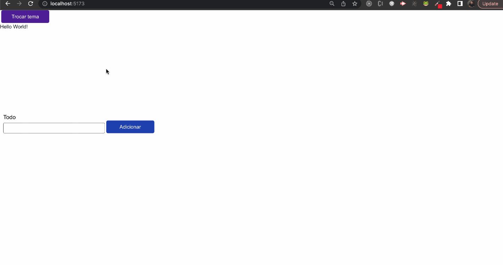

# React State Managers

This project contains five projects created using Vite using five technologies of react state management:

- Context API - https://react.dev/reference/react/createContext
- Redux and Redux Toolkit - https://redux-toolkit.js.org/
- Jotai - https://jotai.org/
- Zustand - https://zustand-demo.pmnd.rs/
- Recoil - https://recoiljs.org/

To reproduce the state management, I created a simple TODO App and Theme Change Color (Dark mode)

You can use the extensions of React Developer Tools of chrome to view the render of each component.

https://chrome.google.com/webstore/detail/react-developer-tools/fmkadmapgofadopljbjfkapdkoienihi

And for Redux: https://chrome.google.com/webstore/detail/redux-devtools/lmhkpmbekcpmknklioeibfkpmmfibljd



## Pre-requisites

- Node
- Yarn or NPM

## How to run?

1. Install dependencies

```sh
cd some-project
```

```sh
yarn
```

or

```sh
npm install
```

2. Running the project

```sh
yarn dev
```

or

```sh
npm run dev
```
